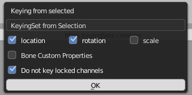

# Features

MassKeyingSets can mass create KeyingSets for objects or Bones  

# Version
Cet addon fonctionne avec la version 2.8x de Blender. Une branche est disponible pour la version 2.7x

# More info ...
... On [BleRiFa](http://blerifa.com/tools/MassKeyingSets/) website

# How to help ?
Buy me a coffee!  

